 ‫CARBON یک توزیع آماده ‫گنو/لینوکسی است که در چندین نسخه، از بسته‌های نرم‌افزاری مختلف در زمینه‌ی علم مواد پشتیبانی می‌کند.‬    
 ‫هدف از تولید CARBON این بوده است که شما بدون نیاز به طی کردن فرآیند پیچیده‌ی نصب و آماده‌سازی نرم‌افزارهای محاسباتی، بتوانید روی رایانه خود به طور آماده با آن‌ها کار کرده و تمام تمرکز خود را روی شبیه‌سازی و محاسباتتان بگذارید.‬     
    
 کاری که تیم توسعه‌ی ‫نرم‌افزارهای محاسباتی در NRTC انجام داده این بوده که یک توزیع گنو/لینوکسی ساخته که پکیج محاسباتی مورد نظر به صورت بهینه روی آن نصب شده است. این توزیع محاسباتی قابلیت این را دارد که به روی سیستم‌عامل شما (چه با GNU/Linux کار کنید و چه کاربر Windows باشید) به صورت یک ماشین مجازی اجرا شود، بدون اینکه با سیستم اصلی شما تداخل داشته باشد.‬        


‫در این راهنما به طور کامل با راه‌اندازی CARBON  روی رایانه خود آشنا می‌شوید.

------------------

### **‫راهنمای کاربران GNU/Linux‬**

‫‫برای استفاده از CARBON شما باید دو برنامه‌ی virtualbox و vagrant را دریافت کنید تا بتوانید بواسطه آن‌ها توزیع محاسباتی CARBON را به طور مجازی روی سیستم خود اجرا و مدیریت کنید.‬        
‫دقت کنید که هردوی این سایت‌ها تحریم هستند و  شما برای دانلود برنامه‌ها نیاز به vpn دارید.‬

‫ابتدا آخرین نسخه virtualbox  را مطابق با سیستم عامل خود از آدرس زیر دریافت کنید:‫

https://www.virtualbox.org/wiki/Downloads

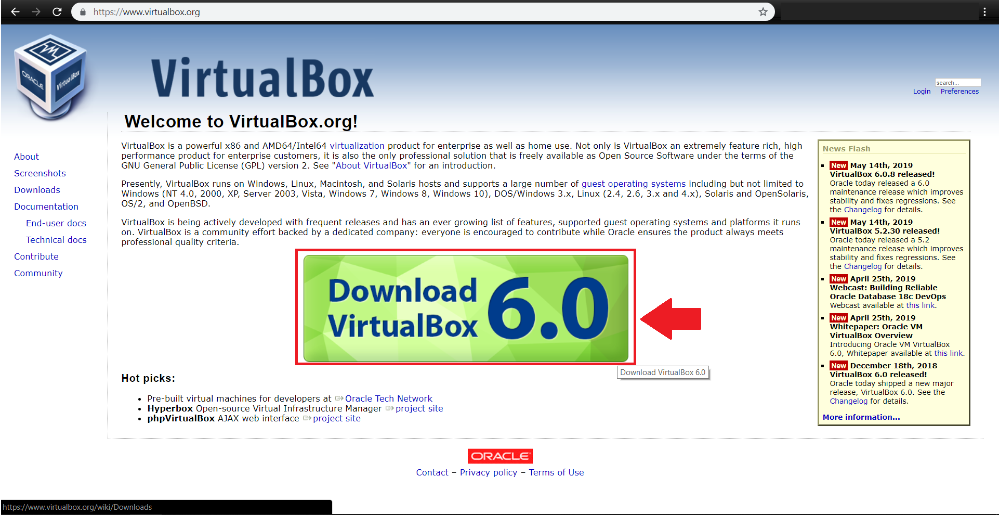

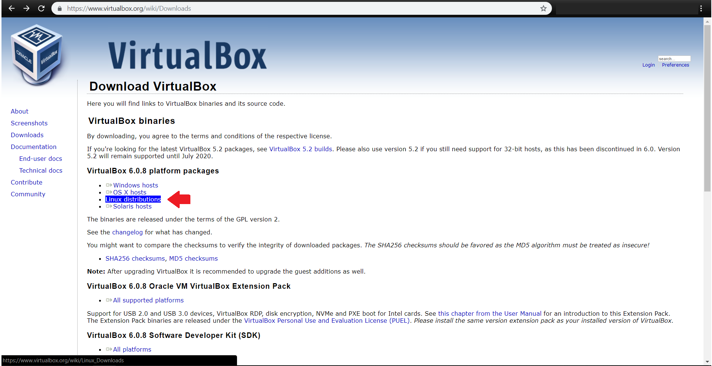

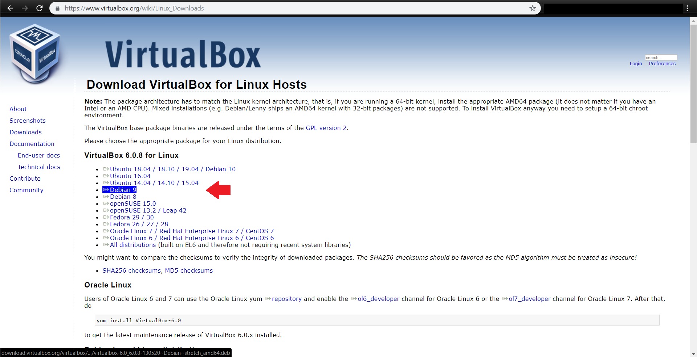

‫فایل virtualbox-6.0_6.0.8-130520_Debian_stretch_amd64.deb  دانلود شده و در مسیر پیشفرض Download  قرار می‌گیرد.‬

‫با دستورات زیر در مسیر جاری برنامه قرار گرفته و برنامه  را نصب می‌کنیم:‬
‍‍‍
```
$ cd Download
```

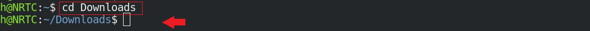

‫دقت کنید که برای نصب، نیاز به دسترسی کابر ریشه (root) دارید:‬

```
# sudo dpkg -i virtualbox-6.0_6.0.8-130520~Debian~stretch_amd64.deb
```
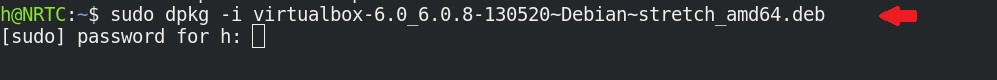

و یا

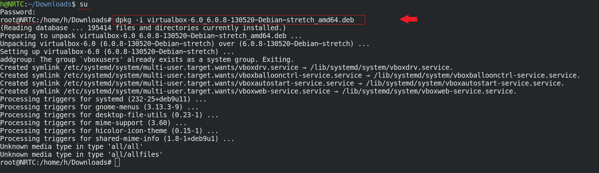


‫همچنین vagrant را نیز مطابق با سیستم عامل خود از آدرس زیر دریافت و نصب کنید:‬

https://www.vagrantup.com/downloads.html

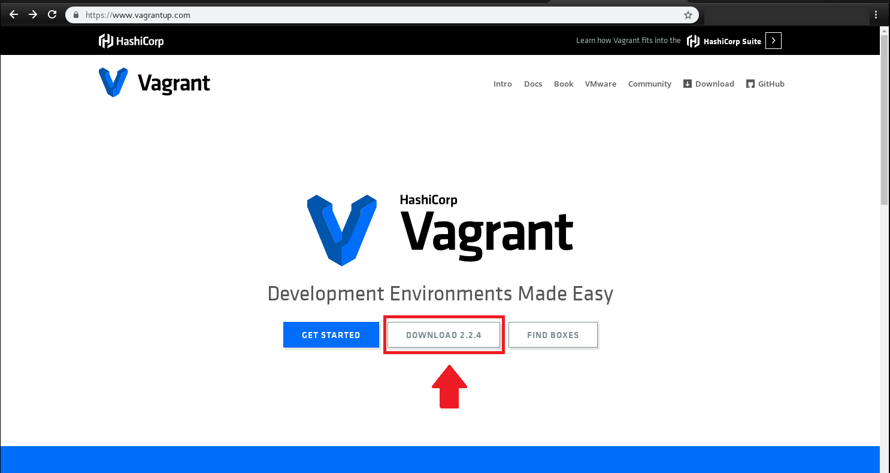

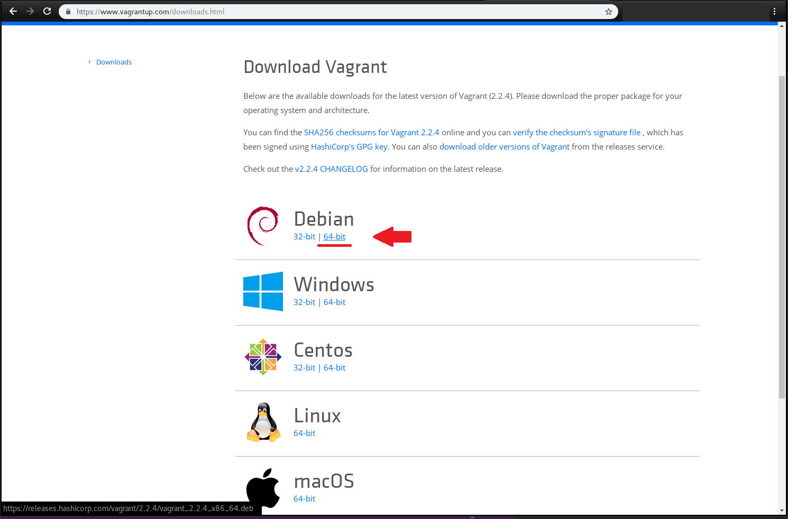


```
$ cd /Download
$ dpkg -i vagrant_2.2.4_x86_64.deb
```


و یا   


‫حال به پوشه‌ای که دیتاهای محاسباتی شما در آن است بروید و دستور زیر را وارد کنید:‬

```
$ vagrant init nrtc/carbon-qe-intel --box-version  0.2

$ vagrant up
```


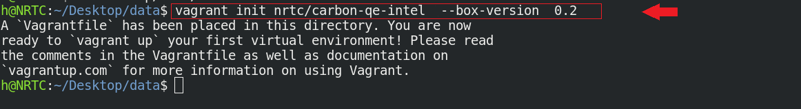
  
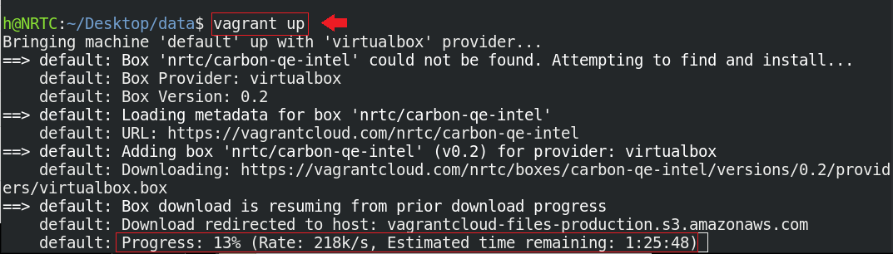

‫در این مرحله باید اندکی صبر کنید تا باکس کربن از [vagrant cloud](https://app.vagrantup.com/nrtc/boxes/carbon-qe-intel) دریافت شود.
‫بهتر است که حوصله‌ی شما متناسب با معکوس سرعت اینترنت‌تان باشد!‬

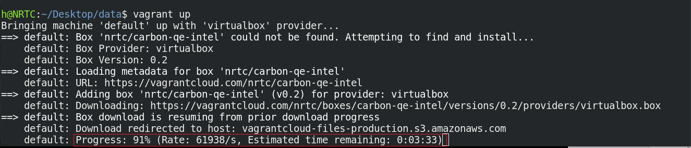

‫اکنون توزیع محاسباتی CARBON بر روی رایانه شما راه اندازی شده است.‬

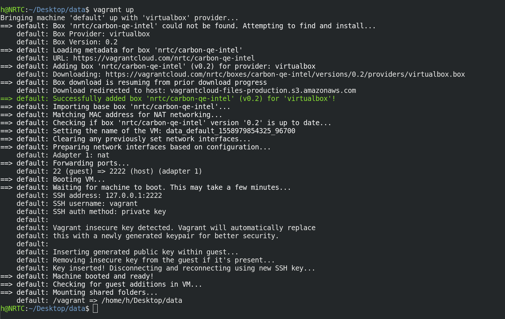


  فقط‫ کافی است تا با دستور زیر وارد محیط CARBON شوید و مدیریت ماشین محاسباتی خود را در دست بگیرید:‬

```
$ vagrant ssh
```
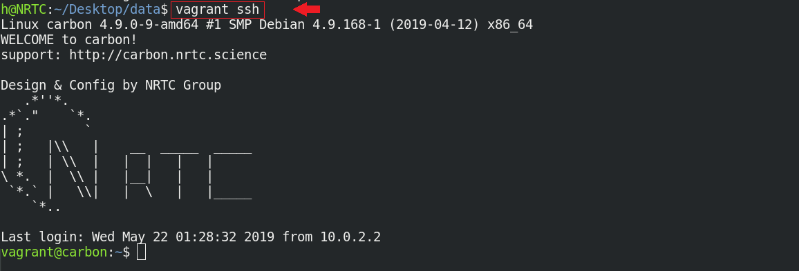
  
‫می‌بینید که خط‌فرمان شما از محیط سیستم عامل اصلی، به محیط سیستم‌عامل محاسباتی CARBON تغییر کرده است. ‬   

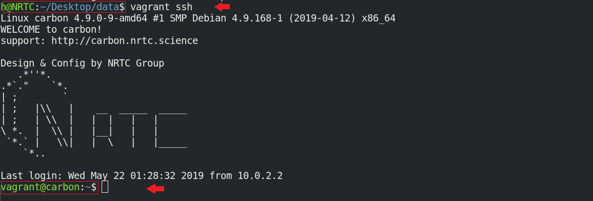
  
‫شما هم اکنون می‌توانید در محیط جدید،‌ بدون نیاز به طی کردن مسیر  پردردسر نصب برنامه، از نرم افزار محاسباتی مد نظر به سادگی استفاده کنید.‬

‫برای این‌که به داده‌های خروجی و نتایج محاسباتتان در سیستم عامل اصلی دسترسی داشته باشید، کافیست تمام اطلاعاتتان را در ماشین مجازی در دایرکتوری ‪/vagrant‬ ذخیره کنید تا در همان مسیر ‪/data‬ در سیستم عامل اصلی آن‌ها را بیابید.‬

```
vagrant@nrtc/carbon:$ /vagrant
```

  
‫برای خروج از CARBON و دسترسی به خط‌فرمان سیستم اصلی خود،کافی است که exit  را در ترمینال تایپ کنید: 

```
$ exit
```
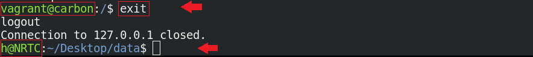

 ‫ویا از کلید میانبر "ctrl+D" استفاده کنید.‬

 ‫پس از خروج از ماشین مجازی CARBON،‌ برای خاموش کردن ماشین،‌ از ‬
 ```
 $ vagrant halt
 ``` 
 ‫استفاده کنید.‬

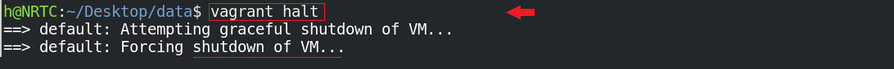

‫داده‌های محاسباتی و همه تغییرات شما در سیستم عامل مجازی CARBON ذخیره شده است. ‬    
برای ورود و خروج‌های بعدی کافی است ‫دستورات زیر را پیش بگیرید:‬
‍‍‍
```
$ vagrant up
$ vagrant ssh
  انجام محاسبات
$ exit 
$ vagrant halt
```


------------

### **‫راهنمای کاربران Windows‬**


‫‫برای استفاده از CARBON شما باید دو برنامه‌ی virtualbox و vagrant را دریافت کنید تا بتوانید بواسطه آن‌ها توزیع محاسباتی CARBON را به طور مجازی روی سیستم خود اجرا و مدیریت کنید.‬    
‫هم‌چنین باید با محیط powershell در ویندوز خود کار کنید.‬


‫ابتدا آخرین نسخه virtualbox  را مطابق با سیستم عامل خود از آدرس زیر دریافت کنید:‫

https://www.virtualbox.org/wiki/Downloads


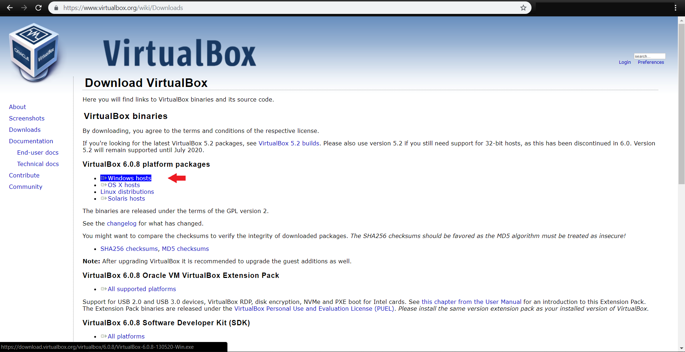


‫همچنین vagrant را نیز مطابق با سیستم عامل خود از آدرس زیر دریافت نمایید:‬

https://www.vagrantup.com/downloads.html


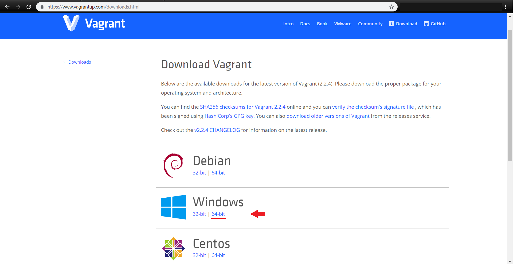

برنامه‌ها‫ی دانلود شده را طبق روال نصب کنید:‬

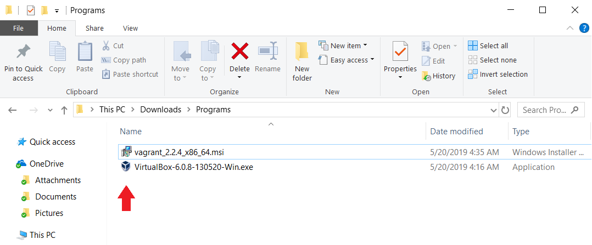

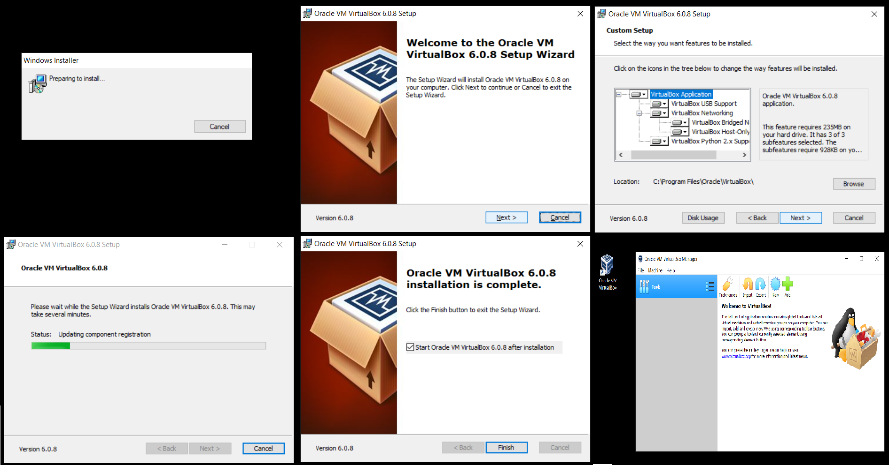

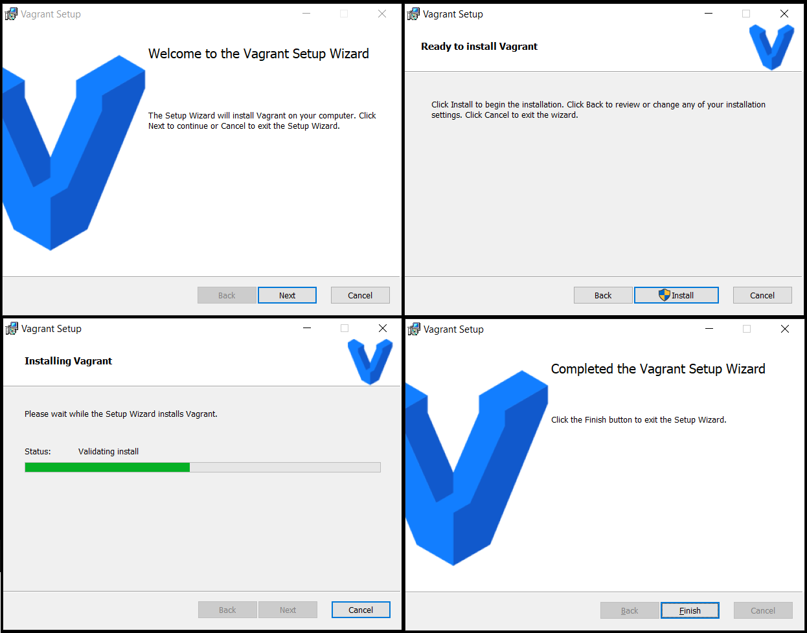

‫پس از اتمام مراحل نصب، powershell ویندوز را باز کنید و به پوشه‌ای که دیتاهای محاسباتی شما در آن است بروید،‬

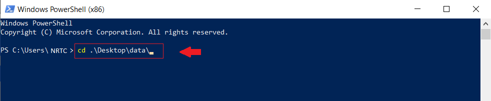

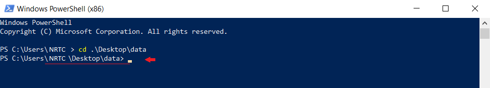

 
 ‫ ودستورات زیر را وارد کنید:

 ```
$ vagrant init nrtc/carbon-qe-intel --box-version  0.2
$ vagrant up
```


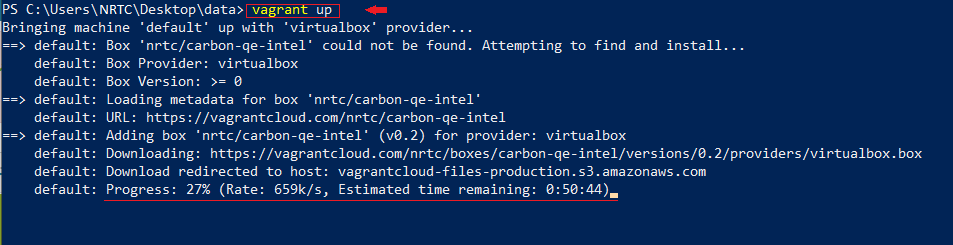

‫این مرحله نیازمند اندکی حوصله است تا باکس کربن از  [vagrant cloud](https://app.vagrantup.com/nrtc/boxes/carbon-qe-intel) روی سیستم شما بارگذاری شود.‬

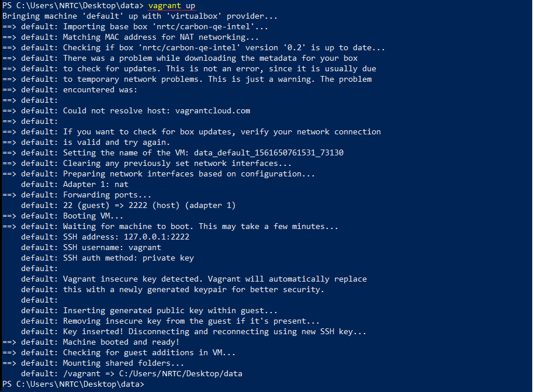


‫حال، توزیع محاسباتی CARBON بر روی رایانه شما راه اندازی شده است.‬ فقط‫ کافی است تا با دستور زیر وارد محیط CARBON شوید و مدیریت ماشین محاسباتی خود را در دست بگیرید:‬

```
$ vagrant ssh
```


‫می‌بینید که خط‌فرمان شما از محیط سیستم عامل اصلی، به محیط سیستم‌عامل محاسباتی CARBON تبدیل شده:‬

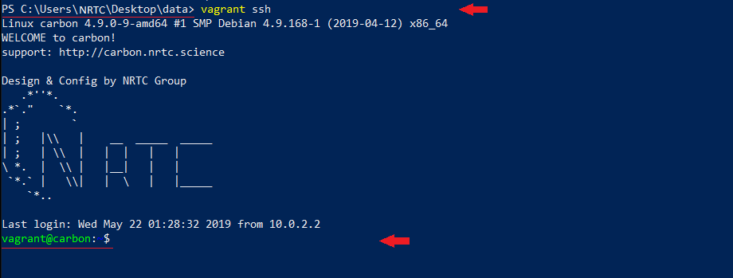

‫شما در محیط جدید،‌ بدون نیاز به طی کردن مسیر پردردسر نصب برنامه، از نرم افزار محاسباتی مد نظر به سادگی استفاده می‌کنید.‬‬

‫برای این‌که به داده‌های خروجی و نتایج محاسبات خود در سیستم عامل اصلی هم ببینید، باید تمام اطلاعاتتان را در ماشین مجازی، در دایرکتوری ‪/vagrant‬ ذخیره کنید تا در همان مسیر ‪\data‬ در سیستم عامل اصلی به آن دسترسی داشته باشید.‬

```
vagrant@nrtc/carbon-qe-intel:$ ~/vagrant
```


‫برای خروج از CARBON و دسترسی به خط‌فرمان سیستم اصلی خود،کافی است که exit  را در ترمینال تایپ کنید:‫ 

```
$ exit
```


 ‫و یا از کلید میانبر "ctrl+D" استفاده کنید.‬


 ‫پس از خروج از ماشین مجازی CARBON،‌ برای خاموش کردن ماشین،‌ از دستور زیر استفاده کنید. ‬
 ```
 $ vagrant halt
 ``` 


‫داده‌های محاسباتی و همه تغییرات شما در سیستم عامل مجازی CARBON ذخیره شده است. ‬    
برای ورود و خروج‌های بعدی کافی است ‫دستورات زیر را پیش بگیرید:‬
‍‍‍
```
$ vagrant up
$ vagrant ssh
  انجام محاسبات
$ exit 
$ vagrant halt
```
---

### **‫نحوه درمیان گذاشتن مشکلات CARBON با ما‬**


‫هرگونه مشکلی را که در حین کار کردن با CARBON به آن برخوردید، می‌توانید از طریق [github](https://github.com/) با ما در میان بگذراید.‬   
‫برای این‌کار باید در ریپازیتوریِ [carbon-linux](https://github.com/NRTC/carbon-linux) موجود در [اکانت گیت‌هابِ NRTC](https://github.com/NRTC) ، یک [issues](https://github.com/NRTC/carbon-linux/issues/new) ارسال کنید.‬

‫مراحل انجام این‌کار را با هم دنبال می کنیم:‬

‫برای این کار وارد اکانت github خود شده و به صفحه اصلی NRTC به آدرس زیر  بروید:‬
https://github.com/NRTC


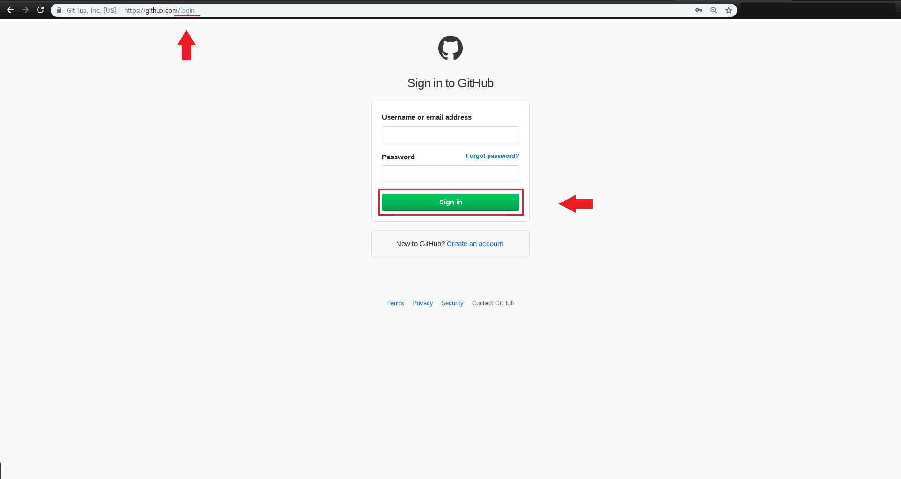

‫به ریپازیتوری carbon-linux وارد شوید ‪

https://github.com/NRTC/carbon-linux

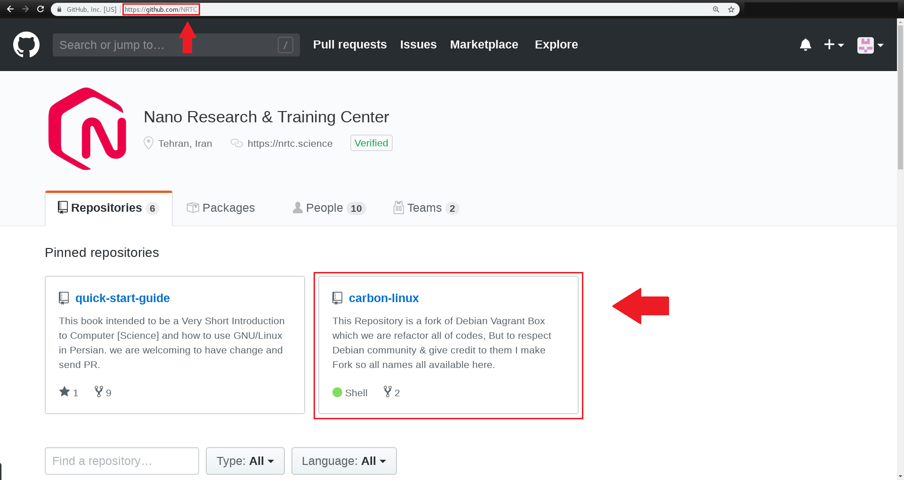

‫و پایین تر از اسم مخزن، روی issue کلیک کنید.‬

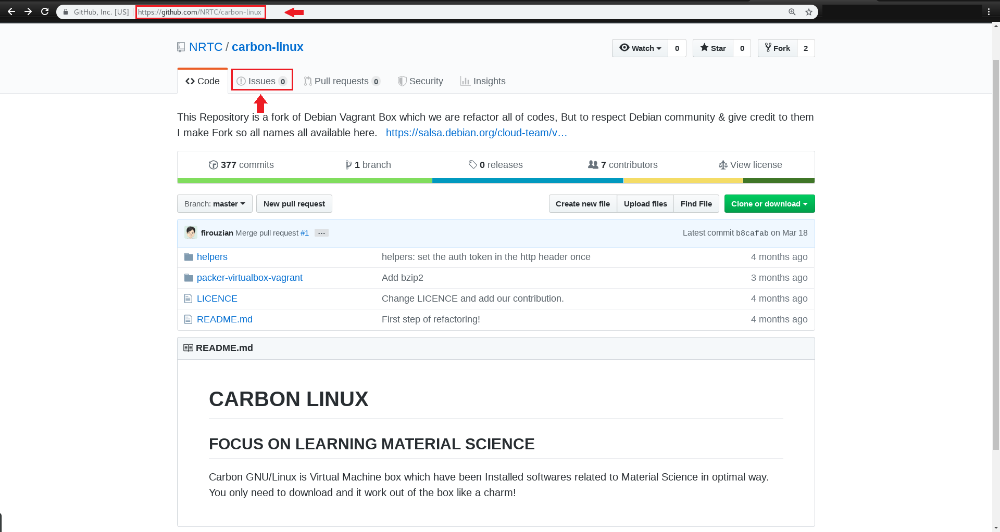

‫یک New Issue ایجاد کرده و عنوان و توضیح مشکل مدّنظر را بنویسید،‬

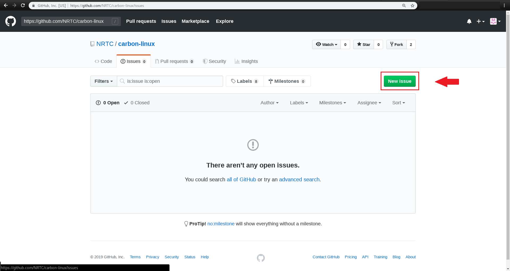

‫و در پایان روی Submit new issue کلیک کرده و آن را ارسال کنید.‬

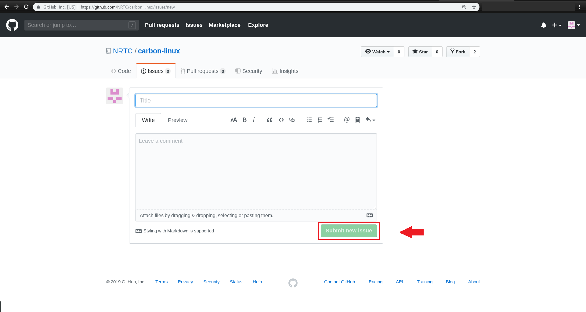

‫با این روش می‌توانید، انتقاد و پیشنهادات و سایر درخواست‌های خود را با ما مطرح کنید.‬